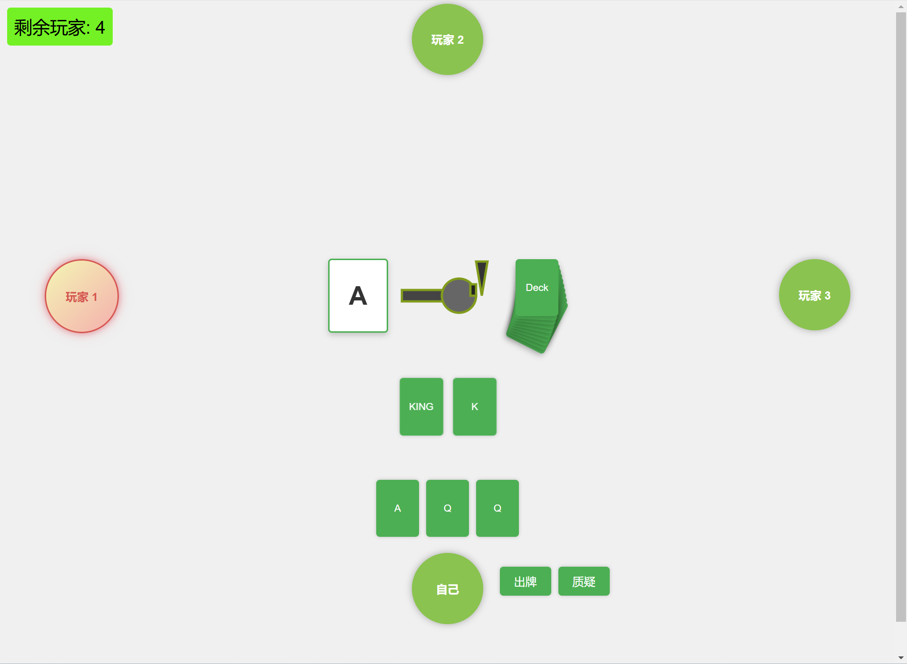

# Liar's Bar

## 参考：

Steam游戏Liar‘s Bar https://www.liarsbar.net/

## 功能

多人在线游玩、实现了骗子酒馆的基本游戏内容

## 技术栈

-java 核心编程语言

-JS+HTML+CSS 用于构建前端页面

-WebSocket 用于客户端和服务器的通信

## 使用：

1、克隆代码到本地仓库。

2、确保您的系统已安装 **Maven** 和 **JDK 8+**。如果尚未安装，请参考以下链接：

- [Maven 下载与安装指南](https://maven.apache.org/install.html)
- [JDK 下载与安装指南](https://www.oracle.com/java/technologies/javase-downloads.html)

3、运行工程文件，maven会自动通过pom.xml中的内容导入依赖项

## 画面展示：

## 联系方式

如果您有任何问题或建议，请通过以下方式联系我：

- GitHub Issues: https://github.com/HOWILLMAKEIT/Liar-s-Bar/issues
- Email: [202330450471@mail.scut.edu.cn](mailto:202330450471@mail.scut.edu.cn)

------

感谢您对 **Liar's Bar** 的支持！希望您喜欢这个项目！
