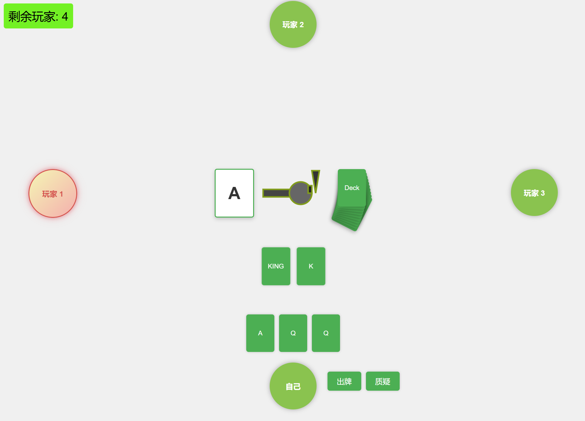
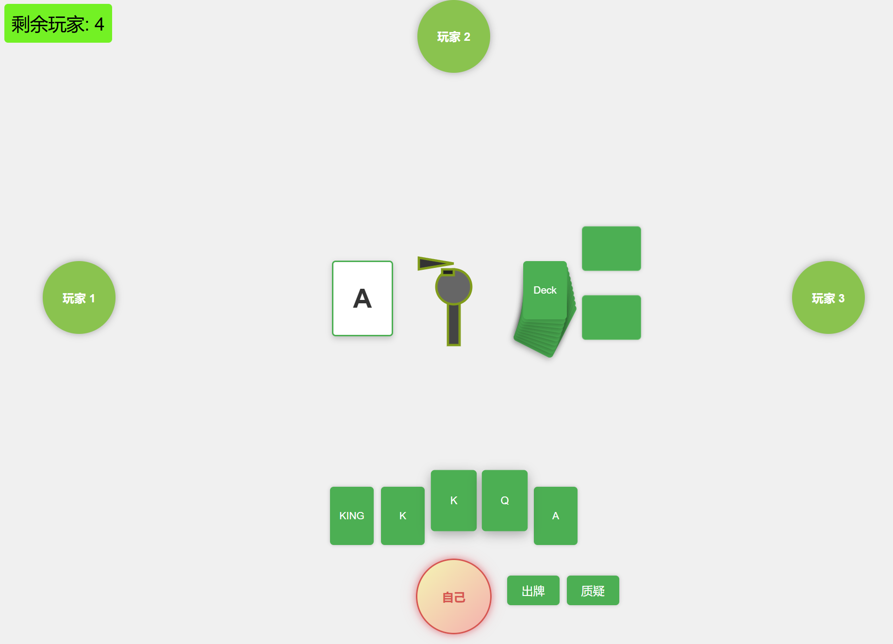
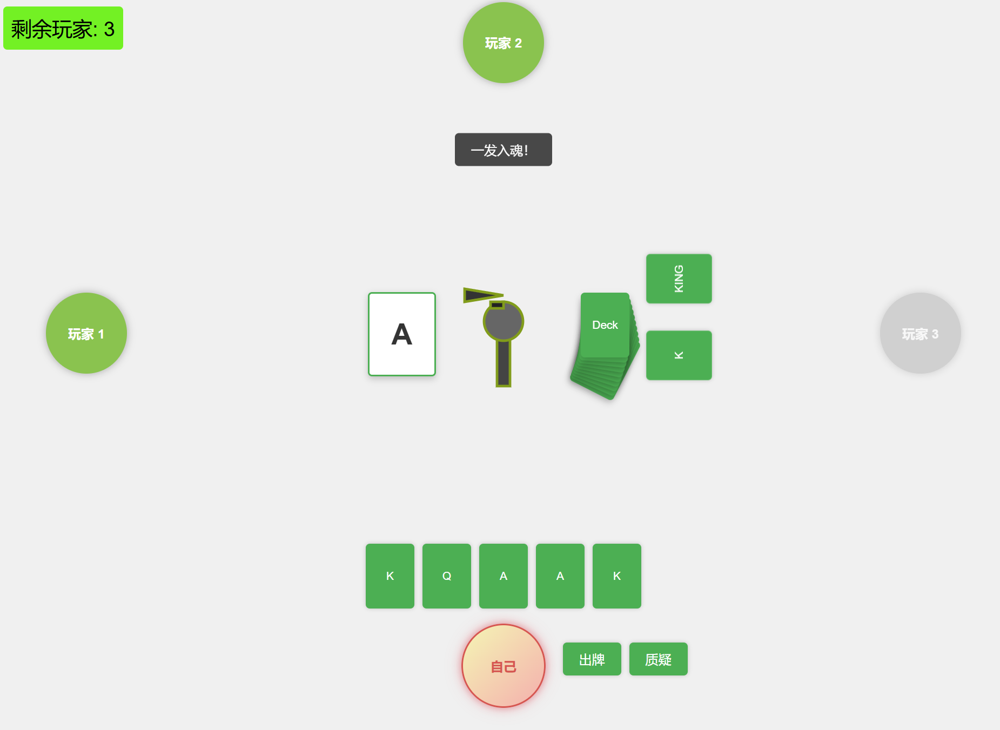

# 2024 SCUT java大作业

基于**Spring boot + WebSocket + JavaScript + html + CSS** 实现的网页游戏

参考：Steam游戏Liar‘s Bar https://www.liarsbar.net/

## 游玩画面如下：

### 出牌后自己视角：

### 出牌后其他玩家视角

### 玩家选择质疑：翻牌并且被淘汰玩家头像变灰

